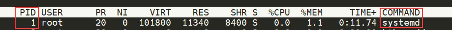

# LINUX

## Linux, c’est quoi?

C’est un système d’exploitation (OS) crée en 1991.
On l’utilise dans divers domaines:

- Panneaux de Contrôle
- Industrie
- Site Web

> Très **LEGER** avec seulement 512Mo Ram
> 

## **Structure Linux**

| `/` | Le répertoire de niveau supérieur est le système de fichiers racine et contient tous les fichiers requis pour démarrer le système d'exploitation avant que d'autres systèmes de fichiers ne soient montés ainsi que les fichiers requis pour démarrer les autres systèmes de fichiers. Après le démarrage, tous les autres systèmes de fichiers sont montés sur des points de montage standard en tant que sous-répertoires de la racine. |
| --- | --- |
| `/bin` | Contient les binaires de commandes essentiels. |
| `/boot` | Se compose du chargeur de démarrage statique, de l'exécutable du noyau et des fichiers requis pour démarrer le système d'exploitation Linux. |
| `/dev` | Contient des fichiers de périphérique pour faciliter l'accès à chaque périphérique matériel connecté au système. |
| `/etc` | Fichiers de configuration du système local. Les fichiers de configuration des applications installées peuvent également être enregistrés ici. |
| `/home` | Chaque utilisateur du système dispose ici d'un sous-répertoire pour le stockage. |
| `/lib` | Fichiers de bibliothèque partagés requis pour le démarrage du système. |
| `/media` | Les périphériques multimédias amovibles externes tels que les clés USB sont montés ici. |
| `/mnt` | Point de montage temporaire pour les systèmes de fichiers standards. |
| `/opt` | Des fichiers facultatifs tels que des outils tiers peuvent être enregistrés ici. |
| `/root` | Le répertoire personnel de l'utilisateur root. |
| `/sbin` | Ce répertoire contient les exécutables utilisés pour l'administration du système (fichiers système binaires). |
| `/tmp` | Le système d'exploitation et de nombreux programmes utilisent ce répertoire pour stocker des fichiers temporaires. Ce répertoire est généralement effacé au démarrage du système et peut être supprimé à d'autres moments sans aucun avertissement. |
| `/usr` | Contient des exécutables, des bibliothèques, des fichiers man, etc. |
| `/var` | Ce répertoire contient des fichiers de données variables tels que des fichiers journaux, des boîtes de réception de courrier électronique, des fichiers liés aux applications Web, des fichiers cron, etc. |

## Commandes Linux

`echo`  → Afficher du texte

Exemple:

```bash
tryhackme@linux1:~$ echo Hello World
Hello World
```

`whoami`  → User connecté sur le Terminal

Exemple:

```bash
tryhackme@linux1:~$ whoami
tryhackme
```

`ls`  → Listing (Découvrir un Fichier)

Exemple:

```bash
tryhackme@linux1:~$ ls [options]
access.log  folder1  folder2  folder3  folder4
```

Principales options:

- `-l` : Affiche les fichiers et répertoires sous forme de liste détaillée, montrant les autorisations, le propriétaire, le groupe, la taille, la date de modification, etc.
- `-a` : Affiche tous les fichiers, y compris ceux dont les noms commencent par un point (fichiers cachés).
- `-h` : Affiche les tailles de fichier de manière lisible par l'homme (par exemple, `1K`, `2M`, `3G`).
- `-R` : Liste récursivement tous les fichiers et sous-répertoires dans les sous-répertoires.

```bash
ls -R repertoire

Repertoire
sous_repertoire1
sous_repertoire2

repertoire/sous_repertoire1:
fichier1.txt
fichier2.txt

repertoire/sous_repertoire2:
fichier3.txt
```

- `-t` : Trie les fichiers par date de modification, affichant les plus récents en premier.
- `-r` : Trie les fichiers en ordre inverse.
- `-S` : Trie les fichiers par taille, affichant les plus grands en premier.
- `-G` : Affiche les fichiers avec des couleurs, facilitant la distinction entre les types de fichiers.
- `-i` : Affiche les numéros d'inode (ID unique pour le fichier) pour chaque fichier.

```bash
ls -i

6364787 fichier1.txt
6364788 fichier2.txt
6364789 fichier3.txt
```

- `-1` : Force la sortie à une colonne, chaque fichier sur une ligne.

`cd`  → Changer de répertoire (Rentrer/Sortir d’un Fichier/Dossier) 

Exemple:

```bash
tryhackme@linux1:~$ ls
access.log  folder1  folder2  folder3  folder4
tryhackme@linux1:~$ cd folder1
tryhackme@linux1:~/folder1$
```

Options:

- Changer de répertoire courant vers le répertoire personnel de l'utilisateur → `cd ~` ou `cd`
- Revenir au répertoire précédent → `cd -`
- Naviguer vers un répertoire parent → `cd ..`

`cat`  → Sortir contenu d’un Fichier (Concaténation)

Exemple:

```bash
tryhackme@linux1:~$ cat [options] fichier.txt
je suis Root
```

Principales options:

- **`-n` →** Affiche le contenu du Fichier avec des numéros de lignes
- **`-b`** → Numérote que les lignes qui contiennent du texte dans le Fichier
- **`-T`** → Affiche les caractères de tabulation (**`^I`**) dans la sortie
- **`-E`** → Ajoute un caractère **`$`** à la fin de chaque ligne de sortie
- **`-v`** → Affiche les caractères non imprimables sous forme de séquences d'échappement (Caractères spéciaux)

`less`  → Afficher le contenu d’un Fichier texte de manière interactive dans un terminal

Exemple:

```bash
tryhackme@linux1:~$ less exemple.txt
```

- Utilisez les touches fléchées ou la barre d'espace pour faire défiler le contenu vers le haut ou vers le bas
- Appuyez sur la touche **`q`** pour quitter **`less`** et revenir au terminal
- Pour rechercher du texte, appuyez sur la touche **`/`**, puis saisissez le texte à rechercher et appuyez sur Entrée. Pour trouver la prochaine occurrence du texte, appuyez sur **`n`**

`pwd`  → Savoir le répertoire du Fichier actuel

Exemple:

```bash
tryhackme@linux1:~$ pwd
/home/tryhackme
```

`find`  → Trouve un Fichier/Dossier (Individuel-Plusieurs)

Exemple:

```bash
tryhackme@linux1:~$ find -name *.txt
./folder4/note.txt

tryhackme@linux1:~$ find -name note.txt
./folder4/note.txt
```

⚠️ Toujours mettre le `-name` après le `find`. Rajoutons à cela, que le “***.txt**” permet de rechercher dans le système tous les Fichiers se terminant par “**.txt**” grâce au “*****”. Tandis que dans l’autre cas, on recherche un seul Fichier nommé “**note.txt**”.

`wc`  → Compte le nombre de lignes, de mots et de caractères dans un fichier ou une entrée fournie via un flux

Exemple:

```bash
tryhackme@linux1:~$ wc [options] folder
```

Principales options:

- **`-l`** → Compter le nombre de lignes
- **`-w`** → Compter le nombre de mots
- **`-c**`  → Compter le nombre de caractères
- **`-m**`  → Compter le nombre de caractères imprimables
- **`-L`** → Afficher la longueur de la ligne la plus longue

`grep`  → Un outil de recherche permettant de rechercher des occurrences de motifs spécifiques dans un fichier ou dans la sortie d’une commande

Exemple:

```bash
tryhackme@linux1:~$ grep [options] folder
```

**Rem: `motif`** → C’est ce que vous souhaitez rechercher dans le fichier. Il peut s'agir d'un mot simple, d'une expression régulière ou d'un motif plus complexe (IP,...)

Principales options:

- **`-i`** → Recherche insensible à la casse (ignorant la distinction entre majuscules et minuscules)
- **`-v`** → Inverse la recherche pour afficher les lignes qui ne correspondent pas au motif
- **`-n`** → Affiche le numéro de ligne pour chaque occurrence trouvée
- **`-c`** → Affiche le nombre total d'occurrences trouvées
- **`-l`** → Affiche uniquement les noms de fichiers contenant des occurrences du motif
- **`-r`** → Recherche récursive dans les répertoires et les sous-répertoires
- **`-E`** → Interprète le motif comme une expression régulière étendue (regex)
- **`-w`** → Recherche de mots entiers (ne correspond pas à des parties de mots)
- **`-A num`** → Affiche **`num`** lignes après chaque occurrence trouvée
- **`-B num`** → Affiche **`num`** lignes avant chaque occurrence trouvée
- **`-C num`** → Affiche **`num`** lignes avant et après chaque occurrence trouvée

**`mkdir`** → Crée un nouveau répertoire (Dossier) dans le système Fichier

Exemple:

```bash
tryhackme@linux1:~$ mkdir [options] nom_du_répertoire

tryhackme@linux1:~$ mkdir /chemin/vers/dossier/nom_du_repertoire
```

Principales options:

- **`-p` →** Crée les répertoires parents si nécessaire. Cette option permet de créer un chemin complet de répertoires si certains d'entre eux n'existent pas encore

```bash
tryhackme@linux1:~$ mkdir -p dossier1/dossier2/dossier3
```

- **`-m` →** Spécifier les permissions lors de la création d'un répertoire

```bash
tryhackme@linux1:~$ mkdir -m 755 nouveau_repertoire
```

**Note:** `755` est un chiffre octal qui représente les permissions suivantes pour le répertoire du fichier `nouveau_repertoire`.

Le premier chiffre `(7)` → Représente les permissions du propriétaire du répertoire

Le deuxième chiffre`(5)` → Représente les permissions du groupe associé au répertoire

Le troisième chiffre `(5)` → Représente les permissions pour les autres utilisateurs

- **`--verbose` →** Affiche un message pour chaque répertoire créé. Cette option est utile si vous voulez voir une confirmation à chaque fois qu'un répertoire est créé

**`rm`** → Supprime des fichiers ou des répertoires

Exemple:

```bash
tryhackme@linux1:~$ rm [options] nom_du_répertoire
```

Principales options:

- **`-f`** → Force la suppression des fichiers sans demander de confirmation, même si les fichiers sont en lecture seule ou s'ils appartiennent à un autre utilisateur
- **`-i`** → Demande une confirmation avant de supprimer chaque fichier. L'utilisateur doit répondre "yes" ou "no" pour chaque fichier avant que la suppression ne soit effectuée
- **`-r, -R`** → Permet de supprimer récursivement les répertoires et leur contenu. Utilisé lorsque vous voulez supprimer un répertoire et tout ce qu'il contient
- **`-preserve-root`** → Empêche **`rm`** de supprimer les répertoires de niveau supérieur de la racine du système de fichiers

**`cp`** → Copie des fichiers ou des répertoires

Exemple:

```bash
tryhackme@linux1:~$ cp [options] folder1 folder2
```

Principales options:

- **`-r`** → Permet de copier récursivement les répertoires et leur contenu
- **`-i`** → Demande une confirmation avant de remplacer des fichiers existants
- **`-f`** → Force la copie en écrasant les fichiers de destination existants sans demander de confirmation
- **`-u`** → Ne copie que les fichiers source qui sont plus récents que les fichiers de destination existants, ou lorsque les fichiers de destination n'existent pas encore
- **`-n`** → Ne copie pas les fichiers si des fichiers de destination avec les mêmes noms existent déjà
- **`-v`** → Affiche des informations détaillées pendant la copie, y compris les fichiers copiés et les répertoires créés

**`mv`** → Déplace ou renomme des fichiers ou des répertoires

Exemple:

```bash
tryhackme@linux1:~$ mv [options] folder1 folder2
```

Principales options:

- **`-i`** → Demande une confirmation avant d'écraser un fichier de destination existant
- **`-f` →** Force le déplacement en écrasant les fichiers de destination existants sans demander de confirmation
- **`-u` →** Ne déplace que les fichiers sources qui sont plus récents que les fichiers de destination existants, ou lorsque les fichiers de destination n'existent pas encore
- **`-v`** → Affiche des informations détaillées pendant le déplacement, y compris les fichiers déplacés et les répertoires créés
- **`-n`** → Ne déplace pas les fichiers si des fichiers de destination avec les mêmes noms existent déjà

**`chmod`** → Modifie les permissions d'accès aux fichiers

Exemple:

```bash
tryhackme@linux1:~$ chmod [options] folder1
```

Principales options:

- **`-R`** → Applique les modifications de permissions récursivement à tous les fichiers et répertoires contenus dans le répertoire spécifié
- **`-v` →** Affiche des informations détaillées sur les modifications de permissions apportées à chaque fichier ou répertoire
- **`-reference`** → Copie les permissions du fichier de référence spécifié et les applique au fichier ou répertoire cible
- **`-changes`** → Affiche uniquement les fichiers dont les permissions ont été effectivement modifiées
- **`-preserve-root`** → Empêche **`chmod`** de changer les permissions du répertoire racine du système de fichiers

**`chown`** → Change le propriétaire et/ou le groupe d'un fichier ou d'un répertoire

Exemple:

```bash
tryhackme@linux1:~$ chown [options] new_owner:new_group file
```

Principales options:

- **`c`** → Affiche un message uniquement si une modification de propriétaire ou de groupe a été effectuée
- **`f`** → Ignore les erreurs et continue de changer les propriétaires et groupes, en omettant les fichiers inaccessibles
- **`R`** → Applique les changements de propriétaire et/ou de groupe récursivement à tous les fichiers et répertoires contenus dans le répertoire spécifié
- **`-dereference`** → Agit sur le fichier cible du lien symbolique, plutôt que sur le lien symbolique lui-même
- **`-from`** → Spécifie le propriétaire et/ou le groupe source à partir duquel effectuer le changement
- **`-reference`** → Utilise les propriétés (propriétaire et groupe) du fichier de référence spécifié pour changer le propriétaire et/ou le groupe du fichier cible
- **`-preserve-root`** → Empêche **`chown`** de modifier le propriétaire ou le groupe du répertoire racine du système de fichiers

**`man`** → Affiche le manuel d'utilisation d'une commande

Exemple:

```bash
bashCopy code
tryhackme@linux1:~$ man [option] command
```

Principales options:

- **`name`** → Recherche les fichiers et répertoires dont le nom correspond au motif spécifié.
- **`type`** → Recherche uniquement des éléments du type spécifié (`f` pour fichier, `d` pour répertoire, etc.).
- **`size`** → Recherche les fichiers de la taille spécifiée. Les options `cwbkMG` indiquent les unités (`c` pour bytes, `w` pour mots, `b` pour blocks, `k` pour kilobytes, `M` pour megabytes, `G` pour gigabytes).
- **`exec`** → Exécute une commande sur chaque fichier trouvé. `{}` est remplacé par le nom du fichier.
- **`delete`** → Supprime les fichiers ou répertoires trouvés.
- **`mtime`** → Recherche les fichiers modifiés il y a le nombre de jours spécifié.
- **`user`** → Recherche les fichiers appartenant à un utilisateur spécifié.
- **`group`** → Recherche les fichiers appartenant à un groupe spécifié.
- **`maxdepth`** → Limite la recherche à une profondeur maximale de *n* répertoires.
- **`mindepth`** → Limite la recherche à une profondeur minimale de *n* répertoires.
- **`empty`** → Recherche les répertoires vides.
- **`perm`** → Recherche les fichiers avec des permissions spécifiques.

**`tar`** → Archive ou extrait des fichiers dans un fichier tar

Exemple:

```bash
tryhackme@linux1:~$ tar [options] [fichier.tar] [fichiers/dossiers à archiver]
tryhackme@linux1:~$ tar [options] -xvf fichier.tar
```

Principales options:

- **`c`** → Crée une nouvelle archive
- **`x`** → Extrait les fichiers d'une archive
- **`v`** → Affiche des informations détaillées pendant l'exécution
- **`f`** → Spécifie le nom du fichier tar. Il est important de noter que l'option `f` doit être suivie immédiatement du nom du fichier tar, sans espace entre eux
- **`z`** → Filtre l'archive à travers gzip pour compresser ou décompresser
- **`j`** → Filtre l'archive à travers bzip2 pour compresser ou décompresser
- **`t`** → Affiche le contenu de l'archive sans l'extraire
- **`r`** → Ajoute des fichiers ou des répertoires à une archive existante
- **`u`** → N'archive que les fichiers qui ont été modifiés depuis la dernière mise à jour de l'archive
- **`A`** → Concatène des archives. Ajoute les fichiers d'une archive à une autre
- **`d`** → Affiche les différences entre l'archive et le système de fichiers
- **`C`** → Spécifie le répertoire où extraire les fichiers
- **`-wildcards`** → Utilise des caractères génériques pour sélectionner les fichiers à archiver
- **`-exclude`** *pattern* → Exclut les fichiers ou répertoires correspondant au motif spécifié
- **`-remove-files`** → Supprime les fichiers après les avoir ajoutés à l'archive

**`nc`** → Utilitaire de connexion réseau pour lire et écrire des données à travers les connexions réseau TCP/IP

Exemple:

```bash
tryhackme@linux1:~$ nc [options] hôte port
```

Principales options:

- **`l`** → Mode écoute, attend une connexion entrante
- **`v`** → Mode verbeux, affiche des informations détaillées sur les opérations en cours
- **`n`** → Désactive la résolution DNS, utilise les adresses IP brutes
- **`p`** → Spécifie le numéro de port local à utiliser
- **`w`** → Définit le délai d'attente pour les connexions
- **`z`** → Balayage de ports, vérifie si les ports sont ouverts sans établir de connexion
- **`u`** → Utilise le protocole UDP plutôt que TCP
- **`k`** → Continue à écouter après la fermeture d'une connexion
- **`r`** → Permet d'utiliser le mode "tapez et sortez" (utilisé avec `l`)
- **`e`** → Spécifie une commande à exécuter après la connexion
- **`i`** → Définit l'interval de temps pour l'utilisation de l'option `z`

**`ssh`** → Établit une connexion sécurisée avec un autre ordinateur (Cryptage)

Exemple:

```bash
tryhackme@linux1:~$ ssh utilisateur@adresse_ip
```

Principales options:

- **`-l` →** Spécifie le nom utilisateur à utiliser lors de la connexion à distance

```bash
ssh -l utilisateur@adresse_ip
```

- **`-p` →** Spécifie le numéro de port à utiliser pour la connexion SSH

⚠️ SSH utilise le port 22, mais avec cette option, vous pouvez spécifier un port différent

- **`-i`** → Spécifie le chemin vers le fichier de clé privée à utiliser pour l'authentification

```bash
ssh -i /home/user/keys/my_key.pem utilisateur@hote_distant
```

- **`-X`** → Active le transfert X11, permettant d'exécuter des applications graphiques à distance
- **`-v`** → Active le mode verbeux, affichant des informations détaillées sur la connexion SSH, y compris les étapes d'authentification.
- **`-A`** → Transfère les informations d'authentification (comme les clés d'authentification SSH) de l'hôte local à l'hôte distant, permettant de se connecter à d'autres systèmes à partir de l'hôte distant sans avoir à saisir de mot de passe
- **`-L` →** Crée un tunnel SSH local, redirigeant le trafic d'un port sur l'hôte local vers un port sur l'hôte distant

```bash
ssh -L [port_local:]hote:port_distant utilisateur@hote_distant

ssh -L 8080:localhost:80 user@example.com
```

**`[port_local:]`** → Spécifie le numéro de port sur l'hôte local à écouter pour les connexions entrantes. Si non spécifié, le port local par défaut sera utilisé

**`hote`** → Spécifie l'adresse de l'hôte distant vers lequel rediriger le trafic

**`port_distant`** → Spécifie le numéro de port sur l'hôte distant vers lequel rediriger le trafic

**`utilisateur@hote_distant`** → Identifie l'utilisateur et l'hôte distant auquel se connecter

- **`-R` →** Crée un tunnel SSH distant, redirigeant le trafic d'un port sur l'hôte distant vers un port sur l'hôte local
    
    ```bash
    ssh -R [port_local:]hote:port_distant utilisateur@hote_distant
    
    ssh -R 2222:localhost:22 user@example.com
    ```
    

**`[port_local:]`** : Facultatif. Spécifie le numéro de port sur l'hôte local à écouter pour les connexions entrantes. Si non spécifié, le port local par défaut sera utilisé.

**`hote`** : Spécifie l'adresse de l'hôte local vers lequel rediriger le trafic.

**`port_distant`** : Spécifie le numéro de port sur l'hôte distant vers lequel rediriger le trafic.

**`utilisateur@hote_distant`** : Identifie l'utilisateur et l'hôte distant auquel se connecter.

- **`-C`** → Active la compression de données pour améliorer les performances sur les connexions lentes
- **`-N`** → Spécifie que la commande SSH doit être utilisée pour transférer des ports ou des fichiers, mais pas pour ouvrir un Shell interactif sur l'hôte distant

**`head`** → Affiche les premières lignes d'un fichier

Exemple:

```bash
tryhackme@linux1:~$ head [options] folder1
```

Principales options:

- **`-n NOMBRE`** → Spécifie le nombre de lignes à afficher
- **`-c NOMBRE`** → Spécifie le nombre de bytes à afficher (au lieu de lignes)

**`tail`** → Affiche les dernières lignes d'un fichier

Exemple:

```bash
tryhackme@linux1:~$ tail [options] folder1
```

Principales options:

- **`-n NOMBRE`** → Spécifie le nombre de lignes à afficher
- **`-f`** → Affiche les lignes en temps réel et reste en écoute des modifications apportées au fichier. Utile pour suivre les journaux en direct

**`touch`** → Crée un nouveau Fichier vide ou met à jour la date de modification d'un fichier existant

Exemple:

```bash
tryhackme@linux1:~$ touch [options] folder1
```

Principales options:

- **`-a`** → Met à jour l'horodatage d'accès uniquement (atime)
- **`-c`** → Ne crée pas de fichier s'il n'existe pas
- **`-m`** → Met à jour l'horodatage de modification uniquement (mtime)
- **`-r FICHIER_REFERENCE`** → Utilise les horodatages du fichier de référence
- **`-t TIMESTAMP`** → Utilise un horodatage spécifique au lieu de la date/heure actuelle

**`ln`** → Crée des liens symboliques ou durs vers des fichiers ou des répertoires

```bash
tryhackme@linux1:~$ ln [options] folder1
```

**`df`** → Affiche l'utilisation de l'espace disque sur le système de fichiers.

ifconfig → Affiche interface réseau

netstat -rn → Montre les réseaux disponnible

nc → ecoute des ports

socat

tmux → Permet d’avoir 2 shell

CTRL + b → préfixe de base

CTRL + B (relache) puis c → Ouvrir une fenetree

CTRL + B(relache) puis MAJ + % → ouvrir une fenetre

CTRL + B puis → ou <- swtich

CSS

Copy

Caption

Ctrl+b d -> quitter

Destination     Passerelle      Genmask         Indic   MSS Fenêtre irtt Iface
0.0.0.0         192.168.1.1     0.0.0.0         UG      0 0          0 eth0
192.168.1.0     0.0.0.0         255.255.255.0   U       0 0          0 eth0

Dans cet exemple :

**Destination** indique l'adresse de destination des paquets.

**Passerelle** indique l'adresse IP de la passerelle à utiliser pour atteindre cette destination.

**Genmask** est le masque de sous-réseau correspondant à la destination.

**Indic** est un indicateur qui peut donner des informations supplémentaires sur l'interface utilisée pour atteindre la destination.

**MSS**, **Fenêtre**, et **irtt** sont des valeurs utilisées pour le calcul du MTU (Maximum Transmission Unit) et d'autres paramètres de la connexion.

**Iface** indique l'interface réseau utilisée pour atteindre la destination.

**`du`** → Affiche l'utilisation de l'espace disque par fichier ou répertoire.

**`awk`** → Un puissant outil de traitement de texte pour extraire et manipuler des données.

**`sed`** → Un éditeur de flux pour filtrer et transformer du texte.

**`sort`** → Trie les lignes d'un fichier.

**`uniq`** → Supprime les lignes en double adjacentes dans un fichier trié.

**`curl`** → Transfère des données depuis où vers un serveur.

**`rsync`** → Synchronise les fichiers et les répertoires entre des ordinateurs locaux ou distants.

**`history`** → Affiche l'historique des commandes utilisées dans le terminal.

**`date`** → Affiche la date et l'heure actuelles.

**`uptime`** → Affiche depuis combien de temps le système est en ligne et la charge moyenne.

**`alias`** → Crée des alias pour les commandes.

| `<tool> -h` | Prints the help page of the tool. |
| --- | --- |
| `apropos <keyword>` | Searches through man pages' descriptions for instances of a given
			keyword. |
|  |  |
|  |  |
| `id` | Returns users identity. |
| `hostname` | Sets or prints the name of the current host system. |
| `uname` | Prints operating system name. |
|  |  |
| `ifconfig` | The `ifconfig` utility is
			used to assign or view an address to a network interface and/or
			configure network interface parameters. |
| `ip` | Ip is a utility to show or manipulate routing, network devices,
			interfaces, and tunnels. |
| `netstat` | Shows network status. |
| `ss` | Another utility to investigate sockets. |
| `ps` | Shows process status. |
| `who` | Displays who is logged in. |
| `env` | Prints environment or sets and executes a command. |
| `lsblk` | Lists block devices. |
| `lsusb` | Lists USB devices. |
| `lsof` | Lists opened files. |
| `lspci` | Lists PCI devices. |
| `sudo` | Execute command as a different user. |
| `su` | The `su` utility requests
			appropriate user credentials via PAM and switches to that user ID
			(the default user is the superuser). A shell is then executed. |
| `useradd` | Creates a new user or update default new user information. |
| `userdel` | Deletes a user account and related files. |
| `usermod` | Modifies a user account. |
| `addgroup` | Adds a group to the system. |
| `delgroup` | Removes a group from the system. |
| `passwd` | Changes user password. |
| `dpkg` | Install, remove and configure Debian-based packages. |
| `apt` | High-level package management command-line utility. |
| `aptitude` | Alternative to `apt`. |
| `snap` | Install, remove and configure snap packages. |
| `gem` | Standard package manager for Ruby. |
| `pip` | Standard package manager for Python. |
| `git` | Revision control system command-line utility. |
| `systemctl` | Command-line based service and systemd control manager. |
| `ps` | Prints a snapshot of the current processes. |
| `journalctl` | Query the systemd journal. |
| `kill` | Sends a signal to a process. |
| `bg` | Puts a process into background. |
| `jobs` | Lists all processes that are running in the background. |
| `fg` | Puts a process into the foreground. |
| `curl` | Command-line utility to transfer data from or to a server. |
| `wget` | An alternative to `curl` that
			downloads files from FTP or HTTP(s) server. |
| `python3 -m http.server` | Starts a Python3 web server on TCP port 8000. |
|  |  |
|  |  |
| `clear` | Clears the terminal. |
|  |  |
|  |  |
| `tree` | Lists the contents of a directory recursively. |
|  |  |
|  |  |
| `nano` | Terminal based text editor. |
| `which` | Returns the path to a file or link. |
|  |  |
| `updatedb` | Updates the locale database for existing contents on the system. |
| `locate` | Uses the locale database to find contents on the system. |
| `more` | Pager that is used to read STDOUT or files. |
|  |  |
|  |  |
|  |  |
| `sort` | Sorts the contents of STDOUT or a file. |
|  |  |
| `cut` | Removes sections from each line of files. |
| `tr` | Replaces certain characters. |
| `column` | Command-line based utility that formats its input into multiple
			columns. |
| `awk` | Pattern scanning and processing language. |
| `sed` | A stream editor for filtering and transforming text. |
| `visudo` | Verifier le nom du groupe |

## **Téléchargement de fichiers (WGET)**

`wget` → Télécharger des fichiers en Web via HTTP sur son ordinateur.

Exemple:

`wget https://assets.tryhackme.com/additional/linux-fundamentals/part3/myfile.txt`
⚠️ Structure: Adresse Web:Port/Fichier

## **Transfert de fichiers depuis votre hôte - SCP ( SSH )**

`scp` → Moyen de copier des fichiers en toute sécurité entre 2 ordinateurs grâce au protocole SSH (Secure Shell) qui fournit une authentification et un cryptage, ce qui permet d’être anonyme. 

- Copiez les fichiers et répertoires de votre système actuel vers un système distant (Exemple1)
- Copiez les fichiers et répertoires d'un système distant vers votre système actuel (Exemple2)

⚠️ Connaître les noms d’utilisateur et les mots de passe d’un utilisateur sur votre système actuel et d’un utilisateur sur le système distant

Exemple1:

| **Variable** | **Valeur** |
| --- | --- |
| L'adresse IP du système distant | 192.168.1.30 |
| Utilisateur sur le système distant | Ubuntu |
| Nom du fichier sur le système local | important.txt |
| Nom sous lequel nous souhaitons stocker le fichier sur le système distant | transféré.txt |

`scp important.txt ubuntu@192.168.1.30:/home/ubuntu/transferred.txt`

Exemple2:

| **Variable** | **Valeur** |
| --- | --- |
| Adresse IP du système distant | 192.168.1.30 |
| Utilisateur sur le système distant | Ubuntu |
| Nom du fichier sur le système distant | documents.txt |
| Nom sous lequel nous souhaitons stocker le fichier sur notre système | notes.txt |

`scp ubuntu@192.168.1.30:/home/ubuntu/documents.txt notes.txt`

## **Servir des fichiers depuis votre hôte - WEB**

HTTPServer → Module Python qui permet que notre ordinateur deviennent un Serveur Web (Simple/Rapide) où l’on dépose nos fichiers afin qu’ils soient téléchargés (Optionnel) par un tiers avec `curl`et `wget`.

**Rem:** Il faut connaître le nom et l'emplacement exacts du fichier que vous souhaitez utiliser. (Updog, meilleur Version)

Exemple:

Exécution du module:

`python3 -m  http.server`

```bash
tryhackme@linux3:/webserver# python3 -m http.serverServingHTTP on 0.0.0.0 port 8000 (http://0.0.0.0:8000/) ...
```

Exécution de wget:

Utilisons `wget` pour télécharger le fichier dans un autre terminal. Car le premier Terminal exécute le Serveur Python3.

```bash
tryhackme@mymachine:~**#** wget http://10.10.224.82:8000/myfile
```

Résultat:

```bash
tryhackme@linux3:/tmp# wget http://10.10.224.82:8000/file2021-05-04 14:26:16  http://127.0.0.1:8000/file
Connecting to http://127.0.0.1:8000... connected.
HTTP request sent, awaiting response... 200 OK
Length: 51095 (50K) [text]
Saving to: ‘file’

file                    100%[=================================================>]  49.90K  --.-KB/s    in 0.04s2021-05-04 14:26:16 (1.31 MB/s) - ‘file’ saved [51095/51095]
```

Pour ouvrir le .flag (Dossier Caché, à cause du point au début du fichier). Il faudra utilisé la commande `ls -a` et ensuite `cat .flag` .

## Processus 101

Processus → Programmes exécutés sur un ordinateur. Chaque Processus aura son propre PID (Processus Identification), où chaque Processus à son propre ID.

⚠️ Les Processus se compilent. (Additionne)

Exemple:

1) Processus: 21 —> PID: 21

2) Processus: 60 —> PID: 60

3) Processus: 95 —> PID: 95

`ps` → Afficher liste de Processus en cours et des informations supplémentaires (Code d’état, la Session exécutée, Durée d’utilisation du CPU (Processeur), …)

Exemple:

```bash
root@ip-10-10-136-179:~# ps
PID TTY          TIME CMD
2860 pts/0    00:00:00 bash
3782 pts/0    00:00:00 ps
```

Nous pouvons aller plus loin, en écrivant `ps -f` pour afficher plus d’informations.

Exemple:

```bash
UID        PID  PPID  C STIME TTY          TIME CMD
root      2860  2852  0 20:17 pts/0    00:00:00 bash
root      6071  2860  0 20:40 pts/0    00:00:00 ps -f
```

- **UID**: Utilisateur exécutant le processus
- **PID**: Numéro du processus (Process ID)
- **PPID**: Numéro du processus parent (Parent Process ID)
- **C**: Utilisation CPU
- **STIME**: Heure à laquelle le processus a démarré
- **TTY**: Terminal TTY qui contrôle ce processus
- **TIME**: Temps CPU accumulé
- **CMD**: Ligne de commande lancée

Pour lister tous les Processus d’un utilisateur, on utilisera `-u` 

Ce qui donne la commande `ps -f -u`

Exemple:

```bash
root@ip-10-10-136-179:~# ps -f -u root
UID        PID  PPID  C STIME TTY          TIME CMD
root         1     0  0 20:13 ?        00:00:02 /sbin/init
root         2     0  0 20:13 ?        00:00:00 [kthreadd]
root         3     2  0 20:13 ?        00:00:00 [kworker/0:0]
… … … … … … … … … … … … … … … … … … … … … … … … … … … … … … …
root      4543     2  0 20:28 ?        00:00:00 [kworker/0:2]
root      6172     2  0 20:41 ?        00:00:00 [kworker/u4:2]
root      6307  2860  0 20:42 pts/0    00:00:00 ps -f -u root
```

Pour voir tous les Processus du Système, on utilisera `ps -ef` 

Nous avons également une autre commande `ps aux` pour afficher plus d’informations supplémentaires que la commande `ps -ef`.

Exemple:

```bash
root@ip-10-10-136-179:~# ps aux
USER       PID %CPU %MEM    VSZ   RSS TTY      STAT START   TIME COMMAND
root         1  0.1  0.2 160116  9440 ?        Ss   20:13   0:02 /sbin/init
root         2  0.0  0.0      0     0 ?        S    20:13   0:00 [kthreadd]
… … … … … … … … … … … … … … … … … … … … … … … … … … … … … … … … … … … … … …
root      6172  0.0  0.0      0     0 ?        I    20:41   0:00 [kworker/u4:2]
root      7058  0.0  0.0  39680  3744 pts/0    R+   20:48   0:00 ps aux
```

- **USER**: Utilisateur exécutant le processus
- **PID**: Numéro du processus (Process ID)
- **%CPU**: Utilisation CPU
- **%MEM**: Utilisation Mémoire physique
- **VSZ**: Mémoire virtuelle du processus (en Kio)
- **RSS**: Mémoire physique (hors pagination) du processus (en Kio)
- **TTY**: Terminal TTY qui contrôle ce processus
- **STAT**: Statut du processus *
- **START**: Heure à laquelle le procesus a démarré
- **TIME**: Temps CPU accumulé
- **COMMAND**: Ligne de commande lancée

`top` → Donne les Statistiques en temps réel sur le Processus en cours d’exécution sur son système au lieu d’une vue unique tel que `ps aux` , `ps -ef` …

Exemple:

```bash
top - 21:03:08 up 49 min,  0 users,  load average: 0.18, 0.09, 0.06
Tasks: 185 total,   1 running, 140 sleeping,   0 stopped,   0 zombie
%Cpu(s):  3.8 us,  1.3 sy,  0.0 ni, 94.8 id,  0.0 wa,  0.0 hi,  0.0 si,  0.0 st
KiB Mem :  3989960 total,   979260 free,   622476 used,  2388224 buff/cache
KiB Swap:  1048572 total,  1048572 free,        0 used.  3049052 avail Mem

PID USER      PR  NI    VIRT    RES    SHR S  %CPU %MEM     TIME+ COMMAND
1040 root     20   0  257360 104180  28636 S   5.6  2.6   2:04.99 Xvnc
3543 root     20   0  191380  30968   7452 S   1.7  0.8   0:37.54 python
1802 root     20   0  517104  38696  29180 S   0.7  1.0   0:07.68 marco
1996 root     20   0  484328  31464  23864 S   0.7  0.8   0:10.02 command-ap+
2029 root     20   0  485136  28260  20860 S   0.7  0.7   0:20.28 mate-multi+
2852 root     20   0  651152  42032  31708 S   0.7  1.1   0:04.41 mate-termi+
1144 root     20   0  647400  45644  31676 S   0.3  1.1   0:02.21 Xorg
```

- Tasks: Le nombre total de tâches ou de processus en cours d'exécution sur le système.
- Running: Le processus est en cours d'exécution.
- Sleeping: Le processus est en attente d'un événement, tel qu'une entrée/sortie.
- Stopped: Le processus est en pause,
- Zombie: Le processus a terminé son exécution, mais n'a pas encore été nettoyé par le système d'exploitation.

**Gestion des processus**

`kill` → Permet de contrôler le comportement des Processus en leur envoyant différents signaux. Généralement on l’écrit `kill + DIP` .

Exemple:

`kill 1337`

Ils existent plusieurs signaux possibles:

- **SIGTERM:** Ce signal demande à un Processus de se terminer. Il permet au Processus de gérer la terminaison de manière propre en effectuant des tâches de nettoyage nécessaires.

```bash
root@ip-10-10-136-179:~# kill -9 1337
```

**Rem:** L'utilisation de SIGKILL (**`-9`**) force un arrêt immédiat du processus ciblé sans lui permettre de terminer proprement ses tâches en cours ou de libérer les ressources qu'il utilise. C’est une méthode plus brut mais il faut l’employé en dernier recours si le programme ne se stop pas.

- **SIGKILL:** Ce signal arrête immédiatement un Processus. Il n'autorise pas le Processus à effectuer des tâches de nettoyage avant son arrêt, ce qui peut parfois laisser des ressources système inutilisées.

```bash
root@ip-10-10-136-179:~# kill 1337
```

- **SIGSTOP:** Ce signal suspend temporairement l'exécution d'un Processus. Il met le Processus en état de sommeil et le laisse dans cet état jusqu'à ce qu'un autre signal le réveille.

```bash
root@ip-10-10-136-179:~# kill -STOP 1337
```

- **SIGCONT:** Ce signal continue l’exécution d’un Processus lorsque celui-ci a été stoppé par le signal SIGSTOP.

```bash
root@ip-10-10-136-179:~# kill -CONT 1337
```

**Comment démarrent les processus ?**



- Les espaces de noms divisent les ressources de l'ordinateur en tranches pour les Processus, offrant ainsi un moyen d'isoler les processus les uns des autres, ils auront donc une certaine quantité de puissance de calcul (Comme un gâteau coupé en morceaux). Ce qui est essentiel pour la sécurité.
- Chaque Processus est identifié par un PID. Le Processus avec un ID de 0 est l'initialisation du système, tel que **`systemd`** sur Ubuntu gère les processus entre le système d'exploitation et l'utilisateur.
- **`systemd`** est l'un des premiers Processus démarrés lors du démarrage du système. Tout programme que nous démarrons devient un processus enfant de **`systemd`**, ce qui permet un contrôle facile et une identification claire des processus.

**Faire démarrer les processus/services au démarrage**

`systemctl` → Interagir avec le processus de démarrage. Il prendra ce format, `systemctl [option] [service]` .

Exemple:

- Démarrer Apache → `systemctl start apache`
- Arrêter Apache → `systemctl stop apache`
- Activer Apache → `systemctl enable apache`
- Désactiver Apache → `systemctl disable apache`

**Une introduction au Backgrounding et  au Premier Plan**  **sous Linux**

Linux peut s’exécuter dans 2 états:

- Arrière Plan (Back)

```bash
tryhackme@linux3:~$ echo "hi" &
[1] 1254
tryhackme@linux3:~$ hi
```

Nous recevons simplement l'ID du Processus `echo` plutôt que la sortie réelle, car il s'exécute en arrière-plan. Suite à la commande “`&`” (Exécute un programme en Back)

**Rem:** `Ctrl + Z` permet de mettre des éléments en Back et stopper un Script.

- Avant Plan (Front)

`fg` → Permet de mettre des éléments en Front.

## Automatisation

`cron processus` → Processus permettant de planifier une certaine action ou tâche après le démarrage du système grâce au `crontabs`, qui permet de chargé, de faciliter et de gérer les tâches `cron`.

Pour modifier le `cron`, on utilisera la commande `crontab -e`

Les `crontabs` nécessitent 6 valeurs spécifiques :

| Valeur  | Description |
| --- | --- |
| MIN | À quelle minute exécuter |
| HOUR | À quelle heure exécuter |
| DOM | À quel jour du mois exécuter |
| MON | À quel mois de l'année exécuter |
| DOW | À quel jour de la semaine exécuter |
| CMD | La commande réelle qui sera exécutée. |

```bash
0 */12 * * * cp -R /home/cmnatic/Documents /var/backups/
```

⚠️ “*****” souhaitons pas fournir de valeur pour ce champ spécifique.

## Maintenance de votre système : journaux

**`/var/log`** Ils contiennent des fichiers journaux avec des informations de journalisation générées par les différents services et applications en cours d'exécution sur le système.

Ces journaux sont essentiels pour surveiller la santé du système, diagnostiquer les problèmes de performance et détecter les activités suspectes ou malveillantes permettant ainsi d’analyser chaque requête et d’analyser les activités.

Voici 3 services exécuté sur une machine Ubuntu:

- Un serveur web Apache2
- Journaux du service fail2ban, utilisé pour surveiller les tentatives de force brute, par exemple
- Le service UFW qui sert de Pare-Feu afin que les données soient refusées ou acceptées et de gérer les règles du Pare-Feu


Ces 2 fichiers sont intéressants

- `access log` → Enregistre les requêtes entrante.
- `error log` → Enregistre les requêtes sortante.


**Exemple:**

`tryhackme@linux3:/var/log$ ls` Pour lister le répertoire actuel de `/var/log` (Emplacement de donnée importante)

```bash
tryhackme@linux3:/var/log$ ls
alternatives.log       dist-upgrade   kern.log.2.gz
alternatives.log.1     dmesg          landscape
alternatives.log.2.gz  dmesg.0        lastlog
amazon                 dmesg.1.gz     private
apache2                dmesg.2.gz     syslog
apt                    dmesg.3.gz     syslog.1
auth.log               dmesg.4.gz     syslog.2.gz
auth.log.1             dpkg.log       ubuntu-advantage-timer.log
auth.log.2.gz          dpkg.log.1     ubuntu-advantage.log
btmp                   dpkg.log.2.gz  unattended-upgrades
btmp.1                 journal        wtmp
cloud-init-output.log  kern.log
cloud-init.log         kern.log.1
```

`tryhackme@linux3:/var/log$ cd apache2` Pour rentrer dans le Dossier `apache2` 

`tryhackme@linux3:/var/log/apache2$ ls -l` Liste tous les répertoires de façon détaillé avec le `-l`

```bash
tryhackme@linux3:/var/log/apache2$ ls -l
total 12
-rw-r----- 1 root      adm         0 Feb  9 13:33 access.log
-rwxrwxrwx 1 tryhackme tryhackme 209 May  4  2021 access.log.1
-rw-r----- 1 root      adm         0 Feb  9 13:33 error.log
-rw-r----- 1 root      adm       810 Oct 18  2022 error.log.1
-rwxrwxrwx 1 root      adm       464 May  5  2021 error.log.2.gz
-rw-r----- 1 root      adm         0 May  4  2021 other_vhosts_access.log
```

**Rem:** On constate que le Fichier `-rwxrwxrwx` peut être ouvert, lu, exécuté par tous les utilisateurs. C’est donc ce Fichier qu’il faut ouvrir.

`tryhackme@linux3:/var/log/apache2$ less access.log.1` 

or

`tryhackme@linux3:/var/log/apache2$ cat access.log.1` 

```bash
tryhackme@linux3:/var/log/apache2$ less access.log.1
10.9.232.111 - - [04/May/2021:18:18:16 +0000] "GET /catsanddogs.jpg HTTP/1.1" 200 51395 "-" "Mozilla/5.0 (Windows NT 10.0; Win64; x64) AppleWebKit/537.36 (KHTML, like Gecko) Chrome/90.0.4430.93 Safari/537.36"
tryhackme@linux3:/var/log/apache2$
```

## Options Principal (Général)

- **`-h, --help`** → Affiche l'aide et la documentation de la commande
- **`-v, --version`** → Affiche la version de la commande
- **`-l`** → Affiche les résultats de manière détaillée (longue)
- **`-a, --all`** → Affiche tous les fichiers, y compris les fichiers cachés
- **`-R, --recursive`** → Effectue une opération de manière récursive, en incluant les sous-répertoires
- **`-f`** → Force une action, même si elle pourrait échouer ou poser des problèmes
- **`-r`** → Inverse le tri des résultats
- **`-i`** → Demande confirmation avant de supprimer ou d'écraser un fichier
- **`-n`** → Limite le nombre de résultats affichés
- **`-q, --quiet`** → Supprime la sortie normale de la commande, n'affiche que les résultats d'erreur
- **`-o, --output`** → Redirige la sortie vers un fichier ou un autre emplacement
- **`-p, --preserve`** → Préserve les attributs d'origine lors de la copie/déplacement de fichiers
- **`-t`** → Trie les résultats par ordre de modification, d'accès ou d'autres critères
- **`-u`** → Affiche les fichiers non triés, en les présentant dans l'ordre dans lequel ils ont été trouvés
- **`-x`** → Limite la recherche ou l'action à un seul système de fichiers
- **`-c`** → Effectue une opération de calcul ou de comptage
- **`-d`** → Affiche les répertoires au lieu de leur contenu
- **`-e`** → Vérifie si un fichier ou un répertoire existe
- **`-g`** → Affiche le nom de groupe associé à un fichier ou à un répertoire
- **`-k`** → Conserve la disposition de la sortie dans l'ordre de recherche
- **`-m`** → Définit les droits d'accès sur un fichier ou un répertoire
- **`-s`** → Affiche la taille d'un fichier
- **`-w`** → Affiche les résultats de manière large ou détaillée
- **`-x`** → Permet d'exécuter un fichier
- **`-y`** → Répond automatiquement à toutes les questions avec "oui"
- **`-z`** → Comprime les fichiers lors de l'archivage ou du transfert

## Opérateurs Shell

- `&`  → Exécute une commande en arrière plan tout en faisant autre chose

```bash
sleep 5 & # Exécute la commande "sleep 5" en arrière-plan pendant 5 secondes
```

- `&&`  → Exécute une liste de commande 1 par 1

```bash
mkdir test && cd test # Crée un répertoire "test" et si la commande réussit, change dans ce répertoire
```

- `>`  → Crée de nouveau dossier (⚠️Si le Fichier **EXISTE** → **ECRASSER**)

```bash
echo "Hello" > fichier.txt # Écrit "Hello" dans le fichier "fichier.txt" (écrase le contenu s'il existe déjà)
```

- `>>`  → Rajoute le contenu dans le dossier sans **ECRASSER**

```bash
echo "World" >> fichier.txt # Ajoute "World" à la fin du fichier "fichier.txt" (sans écraser le contenu)
```

- **`<`** → Redirige l'entrée standard d'une commande à partir d'un fichier

```bash
cat < fichier.txt # Affiche le contenu du fichier "fichier.txt" à la sortie standard
```

- **`|`** → Passe la sortie d'une commande comme entrée à une autre commande. Permet de chaîner plusieurs commandes ensemble

```bash
ls | grep "fichier" # Liste les fichiers du répertoire courant et filtre ceux qui contiennent "fichier”
```

- **`||`** → Exécute la commande suivante uniquement si la commande précédente a échoué (le code de retour n'est pas 0)

```bash
rm fichier || echo "Le fichier n'existe pas" # Supprime le fichier, si la commande échoue, affiche un message
```

- `:` → Opérateur de résolution de cas (utilisé comme espace réservé ou marqueur dans les Scripts Shell)

```bash
: # Ne fait rien
```

- **`;`** → Sépare deux commandes pour les exécuter l'une après l'autre (séquentiellement)

```bash
mkdir dossier ; cd dossier # Crée un dossier, puis change dans ce dossier
```

- **`-f fichier`** → Vérifie si **`fichier`** existe et est un fichier ordinaire

```bash
if [ -f fichier.txt ]; then
echo "Le fichier existe."
else
echo "Le fichier n'existe pas."
fi
```

- **`-d dossier`** → Vérifie si **`dossier`** existe et est un répertoire

```bash
if [ -d repertoire ]; then
echo "Le répertoire existe."
else
echo "Le répertoire n'existe pas."
fi
```

- **`-z chaine`** → Vérifie si **`chaine`** est vide (Longueur Zéro)

```bash
if [ -z "$variable" ]; then
echo "La variable est vide."
else
echo "La variable n'est pas vide."
fi
```

- **`-eq (Egal)`**, **`-ne (Non Egal)`**, **`-lt (Inférieur)`,** **`-le (Inférieur ou Egal)`**, **`-gt (Supérieur)`**, **`-ge (Supérieur ou Egal)`** → Opérateurs de comparaison numérique

```bash
if [ "$nombre1" -eq "$nombre2" ]; then
echo "Les nombres sont égaux."
else
echo "Les nombres sont différents."
fi
```

- **`-s fichier`** → Vérifie si **fichier** existe et a une taille supérieure à zéro

```bash
if [ -s fichier.txt ]; then
echo "Le fichier n'est pas vide."
else
echo "Le fichier est vide."
fi
```

- **`! condition`** → Négation de la condition